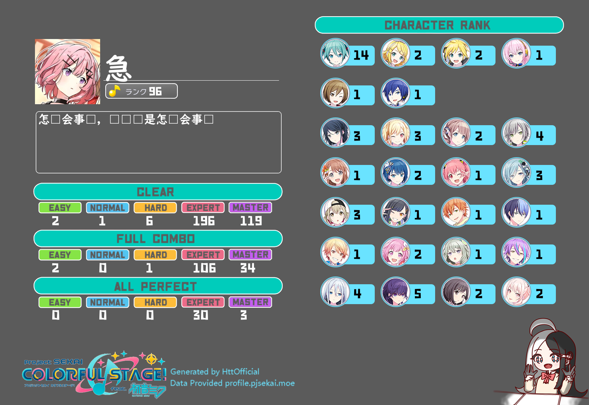

# hoshino-pjsk-plugin 
因为频道里的pjsk查询没有开源 翻了翻pjsk信息网站发现有api于是决定自己做  
指令 `/pjsk绑定+pjskID`可以绑定发送者的qq与pjsk， 
指令`/pjsk进度`可以查询master难度的完成情况 
指令`/pjskpf`可以查询pjsk个人档案（目前只有各难度的clear、FC、AP完成情况，以及各个角色等级） 
指令`/sk`可以查询个人当前活动分数和上一级的分数线 

python初学者 第一次写hoshino的插件 
所以你将可以在py文件中看到：屎山、多段重复代码、莫名其妙的变量名称…… 

## 部署方法 
1.git本项目 将文件夹放在\hoshino\modulus\下 
2.在\config\_bot_.py中加入“hoshino-pjsk-plugin”， 
3.在pjskinfo.py中修改load_path的路径（指向你放本插件的目录） 
例load_path = "C:\\Users\\Administrater\\Desktop\\haru-bot-setup\\hoshino\\modules\\hoshino-pjsk-plugin" 
4.重启并运行hoshino 

## 未来功能 
谱面查询 
歌曲查询 
猜歌（谱面猜歌，曲绘猜歌，歌曲切片猜歌） 
按歌曲别称检索 
（向频道的unibot靠拢） 

## 已知问题 
文件中字体均不支持中日文字混用因此可能会出现下面这种情况 
> 
> 
（如果有佬……）
