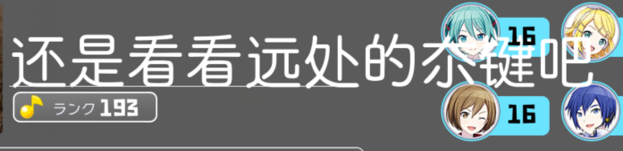

# SBGA还我API！！ 
鉴于unibot以开源 直接开摆（安静地躺平） 

# hoshino-pjsk-plugin 
因为频道里的pjsk查询没有开源 翻了翻pjsk信息网站发现有api于是决定自己做  
指令 `/pjsk绑定+pjskID`可以绑定发送者的qq与pjsk， 
指令`/pjsk进度`可以查询master难度的完成情况 
指令`/pjskpf`可以查询pjsk个人档案（目前只有各难度的clear、FC、AP完成情况，以及各个角色等级） 
指令`/sk`可以查询个人当前活动分数和上一级的分数线 
'/pjsk进度、pjskpf' 支持可以通过@已绑定的群友或后接pjskID逮捕群友！*后接pjskID更新于20220625，前者是已有的功能* 

python初学者 第一次写hoshino的插件 
所以你将可以在py文件中看到：屎山、多段重复代码、莫名其妙的变量名称…… 

## 部署方法 
1.git本项目 将文件夹放在\hoshino\modulus\下 
2.在\config\_bot_.py中加入“hoshino-pjsk-plugin”， 
3.在pjskinfo.py中修改load_path的路径（指向你放本插件的目录） 
例load_path = "C:\\Users\\Administrater\\Desktop\\haru-bot-setup\\hoshino\\modules\\hoshino-pjsk-plugin" 
4.重启并运行hoshino 
运行前最好在account.json里先加上你自己的qqID和pjsk信息 
（因为没试过空文件测试 不知道会有什么问题） 

## 未来功能 
谱面查询 
歌曲查询 
猜歌（谱面猜歌，曲绘猜歌，歌曲切片猜歌） 
按歌曲别称检索 
（向频道的unibot靠拢） 
大部分bug打算随新功能加入一起修复 

unibot开源了就开摆？（bushi） 
会找时间整合功能减少服务器负担（自己挂的bot已经反向了4个了） 

## 已知问题 
~~文件中字体均不支持中日文字混用因此可能会出现下面这种情况~~（换字体后已修） 
> 
~~由于ID过长导致：~~（已修） 
>  
> （笑死） 

 
每次更新活动需重启一次hoshino，原因应该是插件在开头获取一次的活动资源为静态缓存在本地） 
